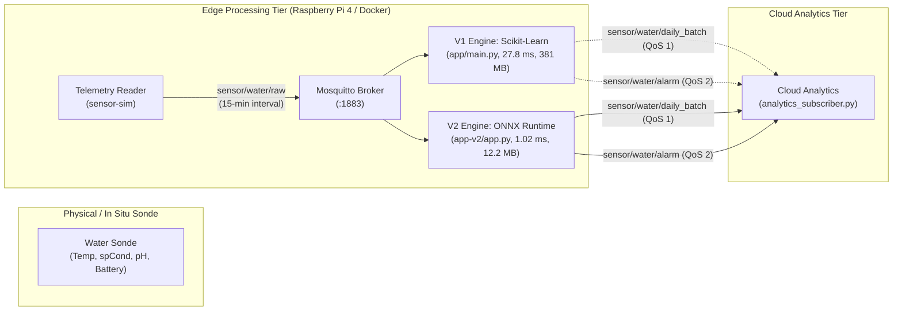

# Chlorophyll-a Soft-Sensor Edge-IoT System

[](https://www.python.org/downloads/)
[](https://www.docker.com/)
[](https://mqtt.org/)
[](LICENSE)

An open-source, edge-native Internet of Things (IoT) system for real-time **Chlorophyll-a concentration soft-sensing** and **Harmful Algal Bloom (HAB)** early detection in freshwater reservoirs. 

Instead of relying on fragile, expensive, and bio-fouling optical fluorometers, this system deploys a lightweight machine learning pipeline on edge hardware (Raspberry Pi 4) to infer Chlorophyll-a concentrations in real time using low-cost, rugged physical surrogate variables: **Water Temperature**, **Specific Electrical Conductance**, **pH**, and **System Battery Voltage**.



> [!TIP]
> **Developer Navigation Guide**: Consult [CODEBASE_INDEX.md](CODEBASE_INDEX.md) for a comprehensive subsystem matrix, symbol directory, MQTT schemas, SQLite DDL, and operational cheatsheet designed for software engineers and autonomous coding agents.

---

## Key Technical Features

* **Dual Edge Inference Topologies**:
  - **V1 Baseline (Scikit-Learn Monolith)**: Deploys a full Python/Scikit-Learn pipeline (`model.joblib`) executing in **~27.7 ms** with **381 MB** RAM footprint.
  - **V2 Optimized (ONNX Decoupled Runtime)**: Pure inference via C++ ONNX Runtime bindings (`model_v2.onnx`), running in **1.02 ms** (**27.2× speedup**) with a **12.2 MB** RAM footprint (**96.8% reduction**) and single-threaded CPU affinity (`intra_op=1, inter_op=1`) eliminating thread contention.
* **Communication Energy Conservation (Smart Batching)**: Aggregates regular operational readings into 24-hour daily arrays (96 samples at 15-minute intervals) published over MQTT QoS 1. Reduces cellular network attach cycles and radio energy consumption by **96.7%** compared to continuous cloud-streaming architectures.
* **Immediate Critical Hazard Alerts**: Bypasses the 24-hour batching queue when Chlorophyll-a exceeds the World Health Organization (WHO) Alert Level 1 threshold ($\ge 10.0\,\mu\text{g/L}$), dispatching an immediate event-driven alarm packet via MQTT QoS 2.
* **Reliability & Crash Resilience**: 
  - **SQLite with Write-Ahead Logging (WAL)**: Ensures zero database corruption during unexpected power cuts or hard resets.
  - **Atomic Checkpointing**: Sensor simulators utilize atomic temp-file replacement (`os.replace`) to maintain continuous tracking across power interruptions.
  - **Test-Before-Swap Remote OTA Updates**: Over-the-Air model updates are verified by SHA-256 hash, trial-loaded in memory, and hot-swapped under a concurrency lock before persistent disk replacement (supporting both `.joblib` in V1 and `.onnx` in V2).

---

## System Architecture & Repository Structure

```
chlorophyll-soft-sensor-edge-iot/
├── CODEBASE_INDEX.md               # Master technical reference & symbol map for developers
├── edge-system/                    # Edge Processing Tier (Docker containerized)
│   ├── app/                        # V1 Inference Engine (Scikit-Learn baseline)
│   │   ├── app.py                  # Monolithic inference, SQLite WAL, batching & OTA logic
│   │   ├── model.joblib            # Active Scikit-Learn Random Forest pipeline
│   │   ├── model_metrics.json      # Model validation & cross-validation metrics
│   │   └── Dockerfile              # Scikit-Learn ARM64/AMD64 edge container (~1.2 GB image)
│   ├── app-v2/                     # V2 Inference Engine (Decoupled ONNX runtime)
│   │   ├── app.py                  # Lightweight ONNX inference, SQLite WAL, batching & OTA
│   │   ├── model_v2.onnx           # Exported chunked ONNX model artifact (10x10 trees)
│   │   ├── target_transform.json   # Target transform parameter specification (lambda, mean, scale)
│   │   └── Dockerfile              # Slim ONNX Runtime edge container (~150 MB image)
│   ├── sensor-sim/                 # Software-in-the-Loop (SIL) telemetry simulator
│   │   ├── sensor_reader.py        # Stream driver with atomic checkpoint state machine
│   │   ├── data/                   # Simulation test dataset (chronological holdout)
│   │   └── Dockerfile              # Telemetry simulator container
│   ├── mosquitto/                  # Edge MQTT broker configuration
│   └── docker/                     # Docker Compose deployment manifests
│       ├── docker-compose.yml      # V1 Production stack (Scikit-Learn)
│       ├── docker-compose-v2.yml   # V2 Production stack (ONNX Runtime)
│       └── docker-compose.override.yml # Development hot-reload configuration
├── cloud-system/                   # Cloud Analytics Tier (100% interoperable with V1 & V2)
│   ├── analytics_subscriber.py     # Batch consumer, fidelity calculator & reporter
│   ├── edge_performance_report.json # Rolling edge KPI report (MAE, R², latency, RAM, CPU)
│   └── requirements.txt            # Cloud tier dependencies
├── model-training/                 # Machine Learning Workstation Tier
│   ├── ml_regression_KFold_model_export.py # Sequential 10-fold CV training pipeline
│   ├── export_onnx.py              # Chunked ONNX exporter (10x10 trees with Sum node)
│   ├── model_test.py               # Local inference QA validation script
│   ├── publish_ota.py              # Remote OTA update publisher (V1 .joblib)
│   ├── publish_ota_v2.py           # Remote OTA update publisher (V2 .onnx)
│   └── requirements.txt            # ML workstation dependencies
├── experiments/                    # V1 Empirical Benchmarking Suite (Scikit-Learn Baseline)
│   ├── run_clean_benchmark.py      # Automated clean-container orchestration driver
│   ├── 01_ml_and_alarm_evaluation.py # Soft-sensor regression and alarm benchmark
│   ├── 02_edge_hardware_profiling.py # Edge resource profiling & energy model
│   ├── 03_system_robustness_ota_suite.py # 5-stage automated resilience & OTA testbench
│   ├── figures/                    # Publication-grade PNG charts and raw CSV datasets
│   └── requirements.txt            # Experiment suite dependencies
└── experiments-v2/                 # V2 Empirical Benchmarking Suite (ONNX Decoupled Tier)
    ├── run_clean_benchmark_v2.py   # Automated clean-container orchestration driver for V2
    ├── 01_ml_and_alarm_evaluation_v2.py # V2 regression & WHO alarm evaluation
    ├── 02_edge_hardware_profiling_v2.py # V2 ONNX latency, RAM, CPU & energy profiling
    └── 03_system_robustness_ota_suite_v2.py # V2 ONNX OTA resilience & hot-swap suite
```

---

## Empirical Benchmark Highlights

### V1 Baseline vs. V2 ONNX Decoupled Architecture Comparison

The physical edge platform was evaluated on a **Raspberry Pi 4 Model B (Quad-Core Cortex-A72 @ 1.5 GHz, ARM64)** across 21,713 continuous chronological observations:

| Performance Dimension | V1 Baseline (`edge-system/app`) | V2 Optimized (`edge-system/app-v2`) | Improvement / Gain |
|---|:---:|:---:|:---:|
| **Inference Engine** | Scikit-Learn Monolith (`joblib`) | ONNX Runtime C++ (`onnxruntime`) | Decoupled Runtime |
| **Mean Inference Latency** | 27.76 ms | **1.02 ms** | **27.2× speedup** |
| **95th Percentile Latency (P95)** | 33.30 ms | **1.45 ms** | **23.0× speedup** |
| **Active Memory Footprint (RSS)** | 381.0 MB | **12.2 MB** | **96.8% memory reduction** |
| **Container Image Footprint** | ~1.20 GB | **~150 MB** | **87.5% smaller image** |
| **Idle CPU Utilization** | 0.2% | **0.0%** (`intra_op=1, inter_op=1`) | No thread spin-locking |
| **Model Artifact Size** | 20.8 MB (`model.joblib`) | **1.1 MB** (`model_v2.onnx`) | **94.7% smaller artifact** |
| **OTA Transfer Time (4G 10 Mbps)** | ~16.6 s | **~0.88 s** | **18.9× faster OTA** |
| **Numerical Prediction Parity** | MAE: 1.218 µg/L, $R^2$: 0.584 | MAE: 1.218 µg/L, $R^2$: 0.584 | **Identical** ($\Delta < 10^{-5}$) |

### Soft-Sensor Prediction Fidelity & Embedded Robustness

| Metric Category | Measured Parameter | Empirical Value | System Interpretation |
|---|---|:---:|---|
| **Inference Fidelity** | Mean Absolute Error (MAE) | **1.218 µg/L** | Captures non-linear biological dynamics (baseline naive error = 2.458 µg/L) |
| **Inference Fidelity** | Coefficient of Determination ($R^2$) | **0.584** | Substantial variance explained using only 4 low-cost physical variables |
| **Alarm Reliability** | WHO Level 1 Recall (Sensitivity) | **81.0%** | Detects over 8 out of 10 blooming events without optical instrumentation |
| **Alarm Reliability** | WHO Level 1 Specificity | **93.8%** | Extremely low false positive rate during non-bloom conditions |
| **Storage Overhead**   | SQLite WAL Insertion Time | **1.86 ms** | Negligible I/O burden on embedded SD/eMMC media |
| **Memory Stability**   | RAM Leak Linear Regression Slope | **-0.00229 MB/sample** | Absolute zero memory accumulation over 21,000+ continuous predictions |
| **Energy Conservation**| Modem Transmission Reduction | **-96.7%** | Cellular energy drops from 28.80 kJ/day (continuous) to 0.96 kJ/day (batched) |
| **Energy Conservation**| Total Daily System Energy Savings | **-34.6%** | Lowers daily buoy energy draw from 43.2 Wh/day to 28.2 Wh/day |
| **System Resilience**  | Fail-Safe & Crash Recovery | **100% Pass** | Zero corrupted database transactions and zero failed OTA rollouts |

---

## Quickstart Guide

### 1. Prerequisites
* [Docker](https://docs.docker.com/get-docker/) & Docker Compose
* Python 3.10+ (for cloud subscriber or workstation training)

### 2. Launch the Edge System (Production Mode)
Navigate to the deployment directory and launch either the optimized V2 engine (recommended) or the V1 baseline:

**Option A: V2 Optimized ONNX Runtime (Recommended)**
```bash
cd edge-system/docker
docker compose -f docker-compose-v2.yml up -d --build
```

**Option B: V1 Baseline Scikit-Learn Stack**
```bash
cd edge-system/docker
docker compose -f docker-compose.yml up -d --build
```

Inspect operational container logs:
```bash
# For V2 ONNX container:
docker compose -f docker-compose-v2.yml logs -f edge_inference_app_v2

# For V1 Scikit-Learn container:
docker compose -f docker-compose.yml logs -f edge_inference_app
```

### 3. Launch Cloud Analytics Monitor
On a workstation or server with network access to the edge broker (100% compatible with both V1 and V2):

```bash
cd cloud-system
python -m venv .venv
source .venv/bin/activate  # Or .venv\Scripts\activate on Windows
pip install -r requirements.txt

# Run the cloud listener (pointing to edge broker IP if remote)
export MQTT_BROKER="localhost"
python analytics_subscriber.py
```

The cloud monitor continuously generates updated fidelity and performance summaries in `cloud-system/edge_performance_report.json`.

### 4. Train or Retrain the Model
To re-run the 10-fold sequential cross-validation pipeline and export both V1 (`model.joblib`) and V2 (`model_v2.onnx`, `target_transform.json`) edge assets:

```bash
cd model-training
pip install -r requirements.txt
python ml_regression_KFold_model_export.py
```

Validate exported model integrity locally:
```bash
python model_test.py
```

### 5. Execute Automated Empirical Benchmarks
Run the automated test runner to reproduce all figures and validation metrics:

**Option A: V2 Decoupled ONNX Benchmarking Suite (Recommended)**
```bash
cd experiments-v2
pip install -r requirements.txt
python run_clean_benchmark_v2.py
```

**Option B: V1 Monolithic Baseline Benchmarking Suite**
```bash
cd experiments
pip install -r requirements.txt

# Run complete clean-container benchmark from scratch
python run_clean_benchmark.py

# Or run individual evaluation scripts
python 01_ml_and_alarm_evaluation.py       # Generates regression & alarm charts
python 02_edge_hardware_profiling.py       # Generates latency, RAM, and energy charts
python 03_system_robustness_ota_suite.py   # Runs the 5-stage resilience test suite
```

---

## MQTT Communication Contracts

The system utilizes 5 core MQTT topics:

| Topic | Publisher | Subscriber | QoS | Payload Summary |
|---|---|---|:---:|---|
| `sensor/water/raw` | `sensor-sim` | `edge-app` | 1 | Real-time JSON telemetry: Temp, spCond, pH, Battery, Ground Truth |
| `sensor/water/daily_batch` | `edge-app` | `cloud-system` | 1 | 96-element JSON array of readings, predictions, and hardware stats |
| `sensor/water/alarm` | `edge-app` | `cloud-system` | 2 | Immediate notification when Predicted Chlorophyll-a $\ge 10.0\,\mu\text{g/L}$ |
| `buoy/ota/update` | `publish_ota.py` | `edge-app` | 1 | Remote update command: `url`, `sha256`, and `version` |
| `buoy/ota/status` | `edge-app` | `publish_ota.py` | 1 | Execution confirmation: `version`, `status`, and `message` |

---

## Scientific Literature References

1. **Mozo, A., Morón-López, J., Vakaruk, S., Pompa-Pernía, A. G., González-Prieto, A., Aguilar, J. A. P., Gómez-Canaval, S., & Ortiz, J. M.** (2022). *Chlorophyll soft-sensor based on machine learning models for algal bloom predictions.* Scientific Reports, 12(1), 13529. [https://doi.org/10.1038/s41598-022-17299-5](https://doi.org/10.1038/s41598-022-17299-5)
2. **Martín-Suazo, S., Morón-López, J., Mozo, A., & Ortiz, J. M.** (2024). *Deep learning methods for multi-horizon long-term forecasting of Harmful Algal Blooms.* Knowledge-Based Systems, 301, 112279. [https://doi.org/10.1016/j.knosys.2024.112279](https://doi.org/10.1016/j.knosys.2024.112279)
3. **World Health Organization (WHO)**. (2003). *Guidelines for safe recreational water environments. Volume 1, Coastal and fresh waters.* World Health Organization.
4. **Pedregosa, F., Varoquaux, G., Gramfort, A., Michel, V., Thirion, B., Grisel, O., Blondel, M., Prettenhofer, P., Weiss, R., Dubourg, V., Vanderplas, J., Passos, A., Cournapeau, D., Brucher, M., Perrot, M., & Duchesnay, E.** (2011). *Scikit-learn: Machine Learning in Python.* Journal of Machine Learning Research, 12, 2825–2830.
