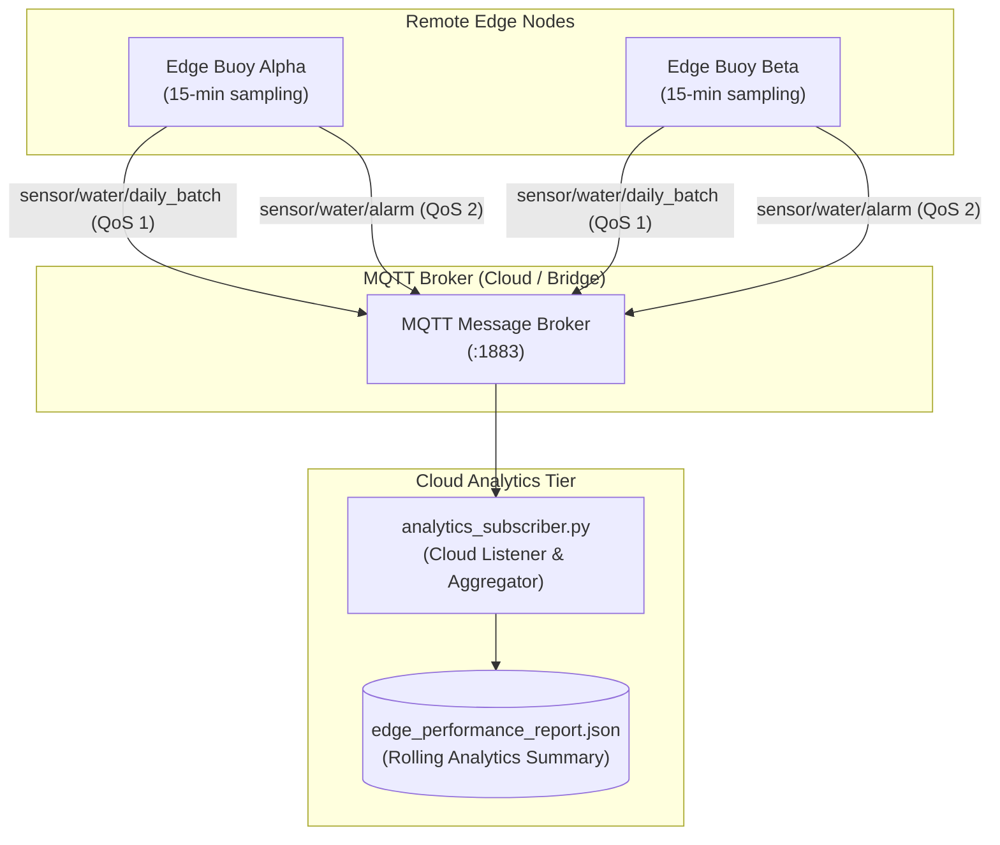

# Cloud Analytics Tier (`cloud-system`)

The **Cloud Analytics Tier** acts as the central monitoring, aggregation, and reporting consumer for the Chlorophyll-a Soft-Sensor Edge-IoT deployment. It is decoupled from high-frequency edge sensing, listening asynchronously for consolidated daily batches and immediate hazard notifications dispatched by remote edge buoys over MQTT.



---

## Subsystem Responsibilities

1. **Decoupled Telemetry Ingestion**: Subscribes to `sensor/water/daily_batch` (QoS 1) to ingest 24-hour consolidated arrays, avoiding the networking overhead and battery drain of continuous connection maintenance.
2. **Immediate Alarm Processing**: Subscribes to `sensor/water/alarm` (QoS 2) to log and handle critical WHO Alert Level 1 hazard exceedances ($\ge 10.0\,\mu\text{g/L}$) without waiting for the daily batch cycle.
3. **Cumulative Statistical Tracking**: Aggregates continuous regression accuracy (Mean Absolute Error, Coefficient of Determination $R^2$) and edge hardware resource profiles (Inference latency, CPU utilization %, and RAM memory footprint).
4. **State Persistence**: Generates and continuously updates `edge_performance_report.json`, serving as a machine-readable summary digest for dashboard integration or alerting pipelines.

---

## Installation & Execution

### 1. Prerequisites
* Python 3.10 or higher
* Network reachability to the MQTT broker (e.g., edge broker on LAN, VPN, or public cloud broker)

### 2. Environment Setup
```bash
cd cloud-system

# Create and activate virtual environment
python -m venv .venv
source .venv/bin/activate       # On Linux/macOS
# .venv\Scripts\activate        # On Windows

# Install required dependencies
pip install -r requirements.txt
```

### 3. Running the Subscriber
```bash
# Optional: override broker host and port via environment variables
export MQTT_BROKER="192.168.1.100"  # Target edge buoy or broker IP
export MQTT_PORT=1883

python analytics_subscriber.py
```

Upon shutdown (via `Ctrl+C`), the subscriber performs a final report generation cycle before disconnecting cleanly.

---

## Ingestion Topic Schemas

### 1. `sensor/water/daily_batch` (QoS 1)
Delivered once per 24-hour period (or upon reaching 96 readings). Payload is a JSON array of individual reading objects:

```json
[
  {
    "timestamp": "2026-09-03T00:15:00Z",
    "predicted_chlorophyll": 2.145,
    "actual_chlorophyll": 1.980,
    "alarm": false,
    "inference_ms": 28.10,
    "db_write_ms": 1.72,
    "cpu_percent": 3.4,
    "ram_mb": 2058.2
  },
  {
    "timestamp": "2026-09-03T00:30:00Z",
    "predicted_chlorophyll": 2.180,
    "actual_chlorophyll": 2.010,
    "alarm": false,
    "inference_ms": 27.85,
    "db_write_ms": 1.69,
    "cpu_percent": 3.1,
    "ram_mb": 2058.4
  }
]
```

### 2. `sensor/water/alarm` (QoS 2)
Dispatched immediately when an inferred Chlorophyll-a reading exceeds the critical hazard threshold:

```json
{
  "timestamp": "2026-09-03T14:45:00Z",
  "predicted_chlorophyll": 12.840,
  "threshold": 10.0,
  "level": "WHO_LEVEL_1"
}
```

---

## Generated Performance Report Schema

The subscriber persists rolling aggregated performance metrics to `cloud-system/edge_performance_report.json`:

```json
{
  "edge_fidelity": {
    "mae": 1.218,
    "r2": 0.584,
    "total_samples": 21638
  },
  "hardware_performance": {
    "inference_ms": {
      "avg": 27.72,
      "p95": 33.30
    },
    "cpu_percent": {
      "avg": 3.1,
      "peak": 18.4
    },
    "ram_mb": {
      "avg": 2055.2,
      "peak": 2068.8
    }
  },
  "system_events": {
    "total_alarms_triggered": 412
  },
  "timestamp": "2026-09-03T15:30:00"
}
```

### Field Definitions

| Metric Field | Type | Units | Description |
|---|---|:---:|---|
| `edge_fidelity.mae` | float | µg/L | Cumulative Mean Absolute Error across all received samples comparing predicted vs. actual ground truth |
| `edge_fidelity.r2` | float | dimensionless | Coefficient of Determination ($R^2$) quantifying proportion of variance explained by the soft-sensor |
| `edge_fidelity.total_samples` | integer | count | Total count of validated sensor readings ingested to date |
| `hardware_performance.inference_ms.avg` | float | ms | Mean inference duration across all predictions on the edge hardware |
| `hardware_performance.inference_ms.p95` | float | ms | 95th percentile execution latency |
| `hardware_performance.cpu_percent.avg` | float | % | Average CPU utilization recorded during inference executions |
| `hardware_performance.cpu_percent.peak` | float | % | Peak CPU utilization observed across the deployment |
| `hardware_performance.ram_mb.avg` | float | MB | Average resident set memory usage of the edge inference process |
| `hardware_performance.ram_mb.peak` | float | MB | Peak RAM usage observed |
| `system_events.total_alarms_triggered` | integer | count | Cumulative count of WHO Alert Level 1 hazard events logged |
| `timestamp` | ISO-8601 string | Local | Timestamp of report generation |
