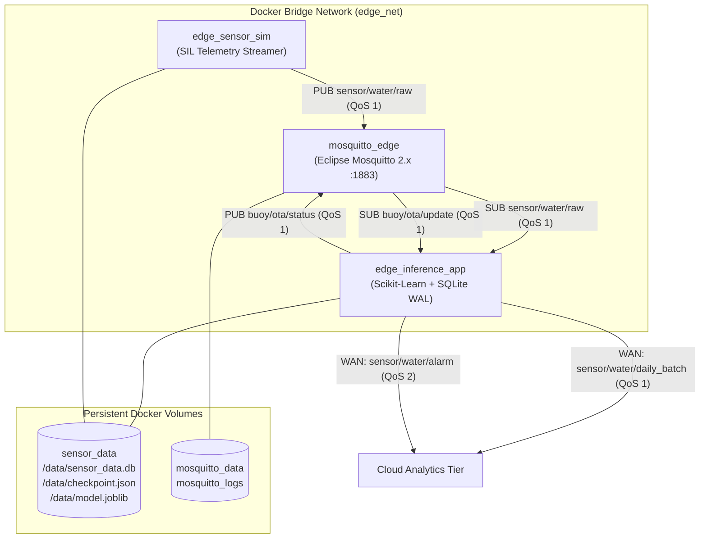

# Edge Processing Tier (`edge-system`)

The **Edge Processing Tier** is the computational core of the Chlorophyll-a Soft-Sensor system. Designed for containerized deployment on ARM64 single-board computers (specifically the **Raspberry Pi 4 Model B**), this subsystem ingests real-time physicochemical telemetry, performs local machine learning inference, stores high-frequency observations in a crash-resilient SQLite database, aggregates daily batches to minimize cellular transmission energy, dispatches immediate hazard alarms, and manages remote Over-The-Air (OTA) model hot-swapping.



---

## Container Topology & Microservices

The subsystem is composed of three containerized services coordinated via Docker Compose:

| Container Service | Base Image | Role & Responsibility | Volume Mounts |
|---|---|---|---|
| `mosquitto_edge` | `eclipse-mosquitto:2` | Local MQTT message broker facilitating inter-process communication (IPC) between containers and WAN telemetry uplinks. | `mosquitto_data:/mosquitto/data`<br/>`mosquitto_logs:/mosquitto/log` |
| `edge_sensor_sim` | `python:3.11-slim` | Software-in-the-Loop (SIL) telemetry simulator that feeds chronological historical sonde observations into the broker at a configurable time-scaled interval. | `sensor_data:/data` |
| `edge_inference_app` | `python:3.11-slim` | Core edge engine. Subscribes to raw sensor readings, runs Random Forest inference, logs hardware resource metrics, persists transactions to SQLite in WAL mode, and manages OTA updates. | `sensor_data:/data` |

---

## Deployment & Execution Workflows

All deployment configurations are located in `edge-system/docker/`.

### 1. Production Mode (Named Persistent Volumes)
Production deployments isolate application state inside managed Docker volumes (`sensor_data`), ensuring that the database, checkpoints, and downloaded OTA models persist across container rebuilds:

```bash
cd edge-system/docker

# Build and start all services in the background
docker compose -f docker-compose.yml up -d --build

# View real-time aggregated logs
docker compose -f docker-compose.yml logs -f

# View inference engine logs specifically
docker compose -f docker-compose.yml logs -f edge_inference_app
```

### 2. Development Mode (Hot-Reload with Local Code Mounts)
For local iterative development and testing, run without specifying `-f`. Docker Compose will automatically merge `docker-compose.yml` and `docker-compose.override.yml`, mounting local source code into the containers:

```bash
cd edge-system/docker
docker compose up -d --build
```

### 3. Container Management Commands
```bash
# Stop containers without removing persistent data
docker compose -f docker-compose.yml stop

# Stop containers and remove networks (preserving named volumes)
docker compose -f docker-compose.yml down

# Complete clean reset: remove containers, networks, and named volumes
docker compose -f docker-compose.yml down -v
```

---

## MQTT Communication Contracts & Topic Schemas

### 1. Topic: `sensor/water/raw`
* **Publisher**: `edge_sensor_sim` (or physical telemetry logger)
* **Subscriber**: `edge_inference_app`
* **QoS**: 1 (At-least-once delivery)
* **Description**: Raw streaming physicochemical observation from the water sonde.

```json
{
  "timestamp": "2026-09-03T10:15:00Z",
  "features": {
    "EXO3(Temp_C)": 21.86,
    "EXO3(spCond_uS_cm)": 71.66,
    "EXO3(pH)": 7.51,
    "SystemBattery": 13.32
  },
  "ground_truth": 0.81
}
```

| Field | Type | Units | Description |
|---|---|:---:|---|
| `timestamp` | ISO-8601 string | UTC | Sampling timestamp |
| `features.EXO3(Temp_C)` | float | °C | Surface water temperature |
| `features.EXO3(spCond_uS_cm)` | float | µS/cm | Specific electrical conductivity |
| `features.EXO3(pH)` | float | pH units | Water pH (acidity / alkalinity) |
| `features.SystemBattery` | float | Volts (V) | Buoy battery voltage (proxy for solar irradiance) |
| `ground_truth` | float | µg/L | Reference optical measurement (used for real-time validation) |

---

### 2. Topic: `sensor/water/daily_batch`
* **Publisher**: `edge_inference_app`
* **Subscriber**: `cloud-system/analytics_subscriber.py`
* **QoS**: 1 (At-least-once delivery)
* **Description**: Array of 96 consolidated readings collected over a 24-hour monitoring period ($96 \times 15\,\text{min} = 24\,\text{hours}$).

```json
[
  {
    "timestamp": "2026-09-03T10:15:00Z",
    "predicted_chlorophyll": 0.899,
    "actual_chlorophyll": 0.810,
    "alarm": false,
    "inference_ms": 27.42,
    "db_write_ms": 1.85,
    "cpu_percent": 3.2,
    "ram_mb": 2056.4
  }
]
```

---

### 3. Topic: `sensor/water/alarm`
* **Publisher**: `edge_inference_app`
* **Subscriber**: Cloud / Alert Management Systems
* **QoS**: 2 (Exactly-once delivery)
* **Description**: Immediate event-driven emergency notification published the instant inferred Chlorophyll-a exceeds the WHO Alert Level 1 threshold ($\ge 10.0\,\mu\text{g/L}$).

```json
{
  "timestamp": "2026-09-03T14:30:00Z",
  "predicted_chlorophyll": 14.235,
  "threshold": 10.0,
  "level": "WHO_LEVEL_1"
}
```

---

### 4. Topic: `buoy/ota/update`
* **Publisher**: `model-training/publish_ota.py` (or CI/CD release workflow)
* **Subscriber**: `edge_inference_app`
* **QoS**: 1 (At-least-once delivery)
* **Description**: Command instructing the edge device to retrieve and deploy an updated model.

```json
{
  "url": "https://github.com/org/repo/releases/download/v1.1.0/model.joblib",
  "sha256": "3a7b8c9d0e1f2a3b4c5d6e7f8a9b0c1d2e3f4a5b6c7d8e9f0a1b2c3d4e5f6a7b",
  "version": "1.1.0"
}
```

---

### 5. Topic: `buoy/ota/status`
* **Publisher**: `edge_inference_app`
* **Subscriber**: Monitoring Console / DevOps
* **QoS**: 1 (At-least-once delivery)
* **Description**: Confirmation emitted upon conclusion of the Test-Before-Swap update process.

```json
{
  "version": "1.1.0",
  "status": "success",
  "message": "Model updated",
  "timestamp": "2026-09-03T15:00:12"
}
```

---

## Embedded SQLite Database & WAL Mode

Edge observations and resource metrics are persisted in `/data/sensor_data.db`.

### Data Definition Language (DDL)

```sql
-- High-frequency telemetry observations and model predictions
CREATE TABLE IF NOT EXISTS readings (
    id                      INTEGER PRIMARY KEY AUTOINCREMENT,
    timestamp               TEXT    NOT NULL,
    temp_c                  REAL,
    spcond_us_cm            REAL,
    ph                      REAL,
    battery                 REAL,
    chlorophyll_predicted   REAL,
    chlorophyll_actual      REAL,
    alarm_triggered         INTEGER DEFAULT 0,
    inference_ms            REAL,
    db_write_ms             REAL,
    processed_at            TEXT    DEFAULT (datetime('now'))
);

-- Edge computational footprint time-series
CREATE TABLE IF NOT EXISTS system_metrics (
    id                      INTEGER PRIMARY KEY AUTOINCREMENT,
    timestamp               TEXT    NOT NULL,
    cpu_percent             REAL,
    ram_mb                  REAL
);
```

### Write-Ahead Logging (WAL) Configuration
On container initialization, the database executes:
```sql
PRAGMA journal_mode = WAL;
PRAGMA synchronous = NORMAL;
```
* **WAL Mode**: Appends transactions to a `.db-wal` write log rather than rewriting database pages in place. Readers and writers operate concurrently without mutex locking.
* **Synchronous = NORMAL**: Commits data safely to disk at checkpoints without forcing immediate disk cache flushes on every single insert, dramatically reducing SD card / eMMC flash write wear.
* **Crash Resilience**: If power is cut mid-transaction, SQLite's recovery automatically rolls back incomplete WAL frames upon reboot, guaranteeing zero table corruption.

---

## Environment Variable Reference

### `edge_inference_app`
| Variable | Default Value | Description |
|---|:---:|---|
| `MQTT_BROKER` | `mqtt_broker` | Hostname or IP of the MQTT broker |
| `MQTT_PORT` | `1883` | MQTT broker port |
| `MODEL_PATH` | `/data/model.joblib` | Active runtime model file on persistent volume |
| `BAKED_MODEL_PATH` | `/app/model.joblib` | Dockerfile-baked fallback model used on initial boot |
| `DB_PATH` | `/data/sensor_data.db` | Path to persistent SQLite database |
| `BATCH_SIZE` | `96` | Number of readings to consolidate into a daily batch ($96 \times 15\,\text{min} = 24\,\text{h}$) |

### `edge_sensor_sim`
| Variable | Default Value | Description |
|---|:---:|---|
| `MQTT_BROKER` | `mqtt_broker` | Hostname or IP of the MQTT broker |
| `MQTT_PORT` | `1883` | MQTT broker port |
| `DATASET_PATH` | `/app/data/simulation_test_data.csv` | Chronological holdout CSV dataset |
| `CHECKPOINT_PATH` | `/data/checkpoint.json` | Persistent state file tracking streaming index |
| `REAL_INTERVAL_SEC` | `900` | Real-world sampling interval ($900\,\text{s} = 15\,\text{min}$) |
| `TIME_SCALE_FACTOR` | `900` | Acceleration factor ($900\times$ equates to $1.0\,\text{s}$ effective per row) |

---

## Test-Before-Swap Over-The-Air (OTA) Architecture

To eliminate the risk of deploying corrupted or incompatible machine learning models over remote cellular links, `app.py` implements a **Test-Before-Swap** fail-safe sequence:

```
1. Download Remote Asset     --> Saved to temporary staging path (/data/model.joblib.tmp)
2. Verify Cryptographic Hash --> SHA-256 computed on bytes; compared to expected hash
                                (If mismatch: abort, delete temp file, report failure)
3. In-Memory Trial-Load      --> joblib.load(temp_path) executed in isolated dummy variable
                                (Catches corrupt bytecode, missing dependencies, or pickling errors)
4. Thread-Safe Hot-Swap      --> Acquire model_lock; swap active in-memory reference to new pipeline
                                (Zero-downtime: incoming inference requests proceed seamlessly)
5. Atomic Disk Persistence   --> os.replace(temp_path, final_path)
                                (Guarantees reboot survival via atomic filesystem inode replacement)
```
