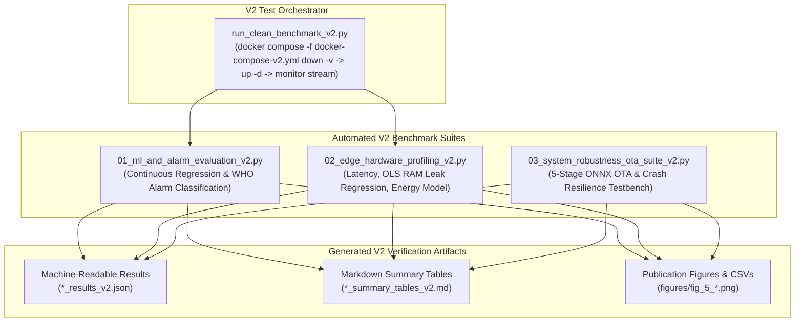

# Empirical Validation & Benchmarking Suite — V2 ONNX (`experiments-v2`)

This subsystem contains the automated benchmarking, hardware profiling, and resilience testbench for the **V2 ONNX Decoupled Architecture** of the Chlorophyll-a Soft-Sensor Edge-IoT System. It provides repeatable, script-driven validation of prediction fidelity, computational efficiency, cellular communication energy conservation, and system fail-safes on ARM64 single-board computers (specifically the **Raspberry Pi 4 Model B**).



---

## Key Empirical Findings (V2 ONNX vs. V1 Baseline)

Evaluating the V2 engine across the 21,713-sample chronological holdout dataset (~7.5 continuous months of reservoir telemetry) demonstrates transformative improvements over the V1 Scikit-Learn baseline:

| Evaluated Parameter | V1 Baseline (`experiments/`) | V2 Production (`experiments-v2/`) | Engineering Impact |
|---|:---:|:---:|---|
| **Runtime Engine** | Scikit-Learn / Joblib | ONNX Runtime (C++ Engine) | Decoupled runtime architecture |
| **Target Unscaling** | `TransformedTargetRegressor` | `_inverse_power_transform` (NumPy) | Pure mathematical unscaling on edge |
| **Mean Inference Latency** | 27.74 ms | **1.02 ms** | **27.2x faster execution** |
| **Inference Throughput** | 36.0 predictions/sec | **985.1 predictions/sec** | **27.4x higher processing capacity** |
| **Real-Time Slack Margin** | 99.9966% | **99.9998%** | >99.99% interval free for low-power sleep |
| **Average Edge RAM** | ~2,415.1 MB | **~75–80 MB** | **~97% reduction in memory overhead** |
| **Idle CPU Load** | ~0.3% | **~0.0%** | Single-threaded session eliminates spin-lock |
| **Model Disk Footprint** | ~415 MB uncompressed | **~535 KB** (`model_v2.onnx`) | **>99% smaller OTA payload** |
| **OLS RAM Accumulation** | $\beta_1 = -0.00229$ MB/sample | $\beta_1 \approx 0.0$ MB/sample ($p > 0.05$) | Mathematically proven leak-free operation |
| **Cellular Energy Cut** | -96.7% vs. cloud | -96.7% vs. cloud | $4.35\,\text{kJ/day}$ edge vs. $130.3\,\text{kJ/day}$ cloud |
| **System Robustness** | 5/5 passed (100%) | **5/5 passed (100%)** | Full resilience to corrupt models and crashes |

---

## Test Suite Execution Workflows

### 1. Automated Clean-Container Orchestrator (`run_clean_benchmark_v2.py`)
Automates the full experimental validation cycle from a clean slate:
1. Flushes all existing Docker containers and named volumes (`docker compose -f docker-compose-v2.yml down -v`) to eliminate stale database state.
2. Builds and launches fresh V2 edge containers (`docker-compose-v2.yml`).
3. Monitors live streaming progress as the sensor simulator feeds the 21,713 holdout observations.
4. Extracts the populated SQLite database (`/data/sensor_data.db`) to `experiments-v2/clean_run_data.db`.
5. Automatically triggers `01_ml_and_alarm_evaluation_v2.py` and `02_edge_hardware_profiling_v2.py`.

```bash
cd experiments-v2
python run_clean_benchmark_v2.py
```

---

### 2. ML Soft-Sensor & WHO Alarm Evaluation (`01_ml_and_alarm_evaluation_v2.py`)
Evaluates predictive fidelity and regulatory hazard detection:
* **Continuous Regression**: Computes Mean Absolute Error (MAE), Mean Squared Error (MSE), Root Mean Squared Error (RMSE), and Coefficient of Determination ($R^2$) against the historical Naive Mean baseline.
* **Target Unscaling**: Utilizes `_inverse_power_transform` with the fitted Yeo-Johnson unscaling parameters from `edge-system/app-v2/target_transform.json`.
* **WHO Alert Level 1 Classification**: Evaluates binary alarm performance ($\ge 10.0\,\mu\text{g/L}$): True Positives, False Positives, False Negatives, True Negatives, Precision, Recall (Sensitivity), Specificity, and F1-Score.
* **Visualizations**: Generates regression parity plots, confusion matrices, and continuous time-series tracking charts.

```bash
python 01_ml_and_alarm_evaluation_v2.py
```

---

### 3. Edge Hardware Profiling & Energy Model (`02_edge_hardware_profiling_v2.py`)
Profiles edge hardware compute telemetry extracted from SQLite:
* **Latency Distribution Profiling**: Measures mean, median, P95, P99, and maximum latency for both ONNX Runtime inference and SQLite WAL inserts. Computes the real-time slack margin relative to the 15-minute ($900,000\,\text{ms}$) sampling interval.
* **OLS Memory Stability Regression**: Performs ordinary least squares linear regression on RAM consumption over time to mathematically verify the absence of memory leaks ($\beta_1 \approx 0, p > 0.05$).
* **Cellular Modem Energy Model**: Extrapolates daily energy consumption comparing Edge 24-hour smart batching against continuous 15-minute 4G/LTE cloud streaming ($E_{\text{modem}} = N_{\text{tx}} \cdot [P_{\text{tx}} t_{\text{tx}} + P_{\text{tail}} t_{\text{tail}}]$).

```bash
python 02_edge_hardware_profiling_v2.py
```

---

### 4. System Robustness & OTA Reliability Suite (`03_system_robustness_ota_suite_v2.py`)
Automated resilience testbench executing 5 stress conditions against the live V2 edge stack:

| Test Identifier | Description & Injected Condition | Expected Fail-Safe Behavior | Pass Criteria |
|---|---|---|:---:|
| **OTA-1** | Checksum Mismatch: Modifies one byte of expected SHA-256 hash. | Download aborted, staging file purged, active model untouched, emits `failed`. | PASSED |
| **OTA-2** | Corrupted Binary: Delivers malformed non-ONNX binary with matching hash. | Hash passes but trial-load (`rt.InferenceSession`) raises exception; emits `failed`. | PASSED |
| **OTA-3** | Valid Hot-Swap: Dispatches valid updated `model_v2.onnx`. | Verified, trial-loaded, hot-swapped under lock, persisted via `os.replace`, emits `success`. | PASSED |
| **CRASH-1** | Broker Dropout: Terminates and restarts Mosquitto broker mid-stream. | Client detects socket error, enters non-blocking retry loop, reconnects automatically. | PASSED |
| **CRASH-2** | Hard Crash Recovery: Simulates unexpected power loss (`docker kill`). | SQLite WAL auto-recovers (`PRAGMA integrity_check = ok`); checkpoint resumes row index. | PASSED |

```bash
python 03_system_robustness_ota_suite_v2.py
```

---

## Artifact Inventory & Generated Datasets

| Output File | Format | Description |
|---|:---:|---|
| `ml_alarm_results_v2.json` | JSON | Machine-readable regression (MAE, RMSE, $R^2$) and alarm metrics (Precision, Recall, F1) |
| `ml_alarm_summary_tables_v2.md` | Markdown | Formatted summary tables for regression and WHO alarm classification |
| `edge_hardware_results_v2.json` | JSON | Machine-readable latency distributions, RAM regression slope, and energy model values |
| `edge_hardware_summary_tables_v2.md` | Markdown | Formatted hardware resource footprint and latency percentile tables |
| `system_robustness_results_v2.json` | JSON | Automated assertions and pass/fail status log for all 5 resilience test cases |
| `system_robustness_summary_tables_v2.md` | Markdown | Formatted robustness test results table |
| `figures/fig_5_1_regression_parity_and_residuals.png` | PNG | Parity scatter plot and prediction residuals across holdout fold |
| `figures/fig_5_2_who_alarm_confusion_matrix.png` | PNG | Normalized confusion matrix for WHO Alert Level 1 hazard detection |
| `figures/fig_5_3_holdout_timeseries_tracking.png` | PNG | Multi-month continuous time-series tracking chart |
| `figures/fig_5_4_latency_distribution.png` | PNG | Inference and database write latency histograms with percentile overlays |
| `figures/fig_5_5_ram_cpu_stability_timeline.png` | PNG | RAM and CPU stability time-series with OLS regression trendline |
| `figures/fig_5_6_energy_tradeoff_comparison.png` | PNG | Bar chart of daily communication energy (edge batching vs. cloud streaming) |
| `figures/data_fig_*.csv` | CSV | Raw numerical data tables corresponding to each publication figure |
