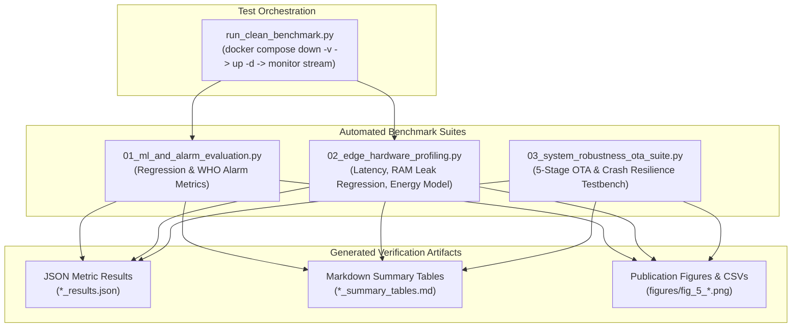

# Empirical Validation & Benchmarking Suite (`experiments`)

This subsystem contains the automated testing, hardware profiling, and performance evaluation testbench for the Chlorophyll-a Soft-Sensor Edge-IoT System (V1 Baseline). It provides repeatable, script-driven validation of soft-sensor prediction fidelity, edge computational resource consumption, cellular energy trade-offs, and system resilience under adverse operating conditions.

> [!NOTE]
> **V1 Baseline vs. V2 ONNX Benchmarking**: This directory evaluates the initial **V1 Scikit-Learn Monolithic Pipeline** (`edge-system/app/main.py`). For the decoupled, high-performance **V2 ONNX Runtime Pipeline** (`edge-system/app-v2/app.py`) featuring 27.2× faster inference (1.02 ms vs. 27.76 ms) and 97% RAM reduction (12.2 MB vs. 381 MB), refer to the companion benchmarking suite in [experiments-v2](../experiments-v2/README.md).




---

## Test Suite Descriptions & Workflows

### 1. Full Clean-Container Benchmark Orchestrator (`run_clean_benchmark.py`)
Automates an end-to-end empirical benchmark from a clean slate:
* Flushes existing Docker containers and named volumes (`docker compose down -v`) to prevent stale database state.
* Rebuilds and initializes clean edge services (`docker compose up -d --build`).
* Monitors streaming progress in real time as the sensor simulator injects the 21,713 holdout observations.
* Extracts the populated database (`/data/sensor_data.db`) to `experiments/clean_run_data.db`.
* Automatically triggers the evaluation scripts (`01` and `02`).

**Execution:**
```bash
python run_clean_benchmark.py
```

---

### 2. ML Soft-Sensor & WHO Alarm Evaluation (`01_ml_and_alarm_evaluation.py`)
Evaluates the trained Random Forest soft-sensor pipeline against the unseen chronological holdout dataset (21,713 samples, ~7.5 continuous months):
* **Continuous Regression Evaluation**: Evaluates Mean Absolute Error (MAE), Mean Squared Error (MSE), Root Mean Squared Error (RMSE), and Coefficient of Determination ($R^2$) against the historical Naive Mean Predictor baseline.
* **WHO Alert Level 1 Classification**: Evaluates binary alarm performance ($\ge 10.0\,\mu\text{g/L}$): True Positives, False Positives, False Negatives, True Negatives, Precision, Recall (Sensitivity), Specificity, and F1-Score.
* **Aesthetic Visualizations**: Generates regression parity/residual plots, confusion matrices, and continuous time-series tracking charts.

**Execution:**
```bash
python 01_ml_and_alarm_evaluation.py
```

---

### 3. Edge Hardware Profiling & Energy Model (`02_edge_hardware_profiling.py`)
Analyzes edge compute execution telemetry extracted from SQLite:
* **Latency Distribution Profiling**: Measures mean, median, P95, P99, and maximum latencies for both Scikit-Learn inference and SQLite WAL inserts. Computes the real-time slack margin relative to the 15-minute ($900,000\,\text{ms}$) sampling window.
* **Memory Stability (Leak-Free Verification)**: Performs ordinary least squares (OLS) linear regression of RAM usage over time to mathematically verify the absence of memory leaks ($\text{slope} \approx 0$).
* **Cellular Energy Trade-Off Model**: Evaluates the mathematical energy model comparing Edge Smart Batching (15-minute low-power wake + 24-hour single batch transmission) against continuous 4G/LTE cellular streaming.

**Execution:**
```bash
python 02_edge_hardware_profiling.py
```

---

### 4. System Robustness & OTA Reliability Suite (`03_system_robustness_ota_suite.py`)
An automated test suite executing 5 stress tests against the live edge system:

| Test Identifier | Name & Objective | Injected Failure / Condition | Expected Fail-Safe Behavior |
|---|---|---|---|
| **OTA-1** | Hash Mismatch Rejection | Modifies one byte of the expected SHA-256 checksum in the MQTT update command. | Edge aborts download, removes temporary file, retains active model, emits `failed` status. |
| **OTA-2** | Corrupted Binary Rejection | Serves a corrupted, non-joblib binary payload over HTTP with a matching hash. | Edge passes hash check but fails in-memory trial load (`joblib.load()`), aborts hot-swap, emits `failed` status. |
| **OTA-3** | Zero-Downtime Hot-Swap | Dispatches valid updated model artifact with correct cryptographic hash. | Edge downloads, verifies hash, passes trial load, hot-swaps under concurrency lock, persists to disk, emits `success`. |
| **OTA-4 (CRASH-1)** | MQTT Broker Dropout | Terminates and restarts the local Mosquitto broker container during live streaming. | Edge client detects socket disconnect, enters non-blocking retry loop, reconnects automatically upon broker recovery. |
| **OTA-5 (CRASH-2)** | Crash Recovery & WAL Integrity | Simulates power interruption mid-stream (`docker compose kill`), followed by container restart. | Checkpoint state resumes from the exact last persisted row index; SQLite WAL auto-recovers with zero database corruption. |

**Execution:**
```bash
python 03_system_robustness_ota_suite.py
```

---

## Artifact Inventory & File Cross-Reference

Executing the testbench produces the following comprehensive set of verification artifacts:

| Output Artifact | Producing Script | Contents & Scope |
|---|---|---|
| `ml_alarm_results.json` | `01_ml_and_alarm_evaluation.py` | Machine-readable metrics for Random Forest and Naive Mean baseline |
| `ml_alarm_summary_tables.md` | `01_ml_and_alarm_evaluation.py` | Markdown tables of regression fidelity and WHO alarm classification |
| `figures/fig_5_1_regression_parity_and_residuals.png` | `01_ml_and_alarm_evaluation.py` | Parity scatter plot ($y$ vs $\hat{y}$) and residual distribution |
| `figures/data_fig_5_1_regression_parity.csv` | `01_ml_and_alarm_evaluation.py` | Underlying CSV data points for Fig 5.1 |
| `figures/fig_5_2_who_alarm_confusion_matrix.png` | `01_ml_and_alarm_evaluation.py` | Annotated confusion matrix for WHO Level 1 alarm threshold |
| `figures/data_fig_5_2_confusion_matrix.csv` | `01_ml_and_alarm_evaluation.py` | Underlying contingency table counts for Fig 5.2 |
| `figures/fig_5_3_holdout_timeseries_tracking.png` | `01_ml_and_alarm_evaluation.py` | Chronological tracking time-series across seasonal bloom event |
| `figures/data_fig_5_3_timeseries_tracking.csv` | `01_ml_and_alarm_evaluation.py` | Underlying chronological time-series points for Fig 5.3 |
| `edge_hardware_results.json` | `02_edge_hardware_profiling.py` | Machine-readable hardware metrics (latencies, RAM, CPU, energy) |
| `edge_hardware_summary_tables.md` | `02_edge_hardware_profiling.py` | Markdown summary tables of edge latency and energy savings |
| `figures/fig_5_4_latency_distribution.png` | `02_edge_hardware_profiling.py` | Inference latency histogram with P95/P99 markers |
| `figures/data_fig_5_4_latency_distribution.csv` | `02_edge_hardware_profiling.py` | Underlying latency observation sample points for Fig 5.4 |
| `figures/fig_5_5_ram_cpu_stability_timeline.png` | `02_edge_hardware_profiling.py` | RAM stability timeline with linear regression trend line and CPU % |
| `figures/data_fig_5_5_ram_cpu_timeline.csv` | `02_edge_hardware_profiling.py` | Underlying RAM/CPU telemetry points for Fig 5.5 |
| `figures/fig_5_6_energy_tradeoff_comparison.png` | `02_edge_hardware_profiling.py` | Grouped bar chart comparing Edge Smart Batching vs Continuous 4G |
| `figures/data_fig_5_6_energy_tradeoff.csv` | `02_edge_hardware_profiling.py` | Underlying energy calculations for Fig 5.6 |
| `system_robustness_results.json` | `03_system_robustness_ota_suite.py`| Test results and execution logs for all 5 resilience test cases |
| `system_robustness_summary_tables.md` | `03_system_robustness_ota_suite.py`| Markdown summary table of fail-safe robustness tests |
| `figures/data_table_5_4_robustness_results.csv` | `03_system_robustness_ota_suite.py`| Tabular summary of robustness test parameters and outcomes |
