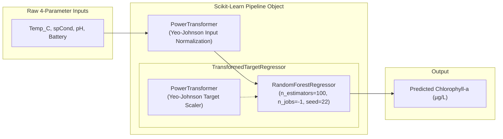
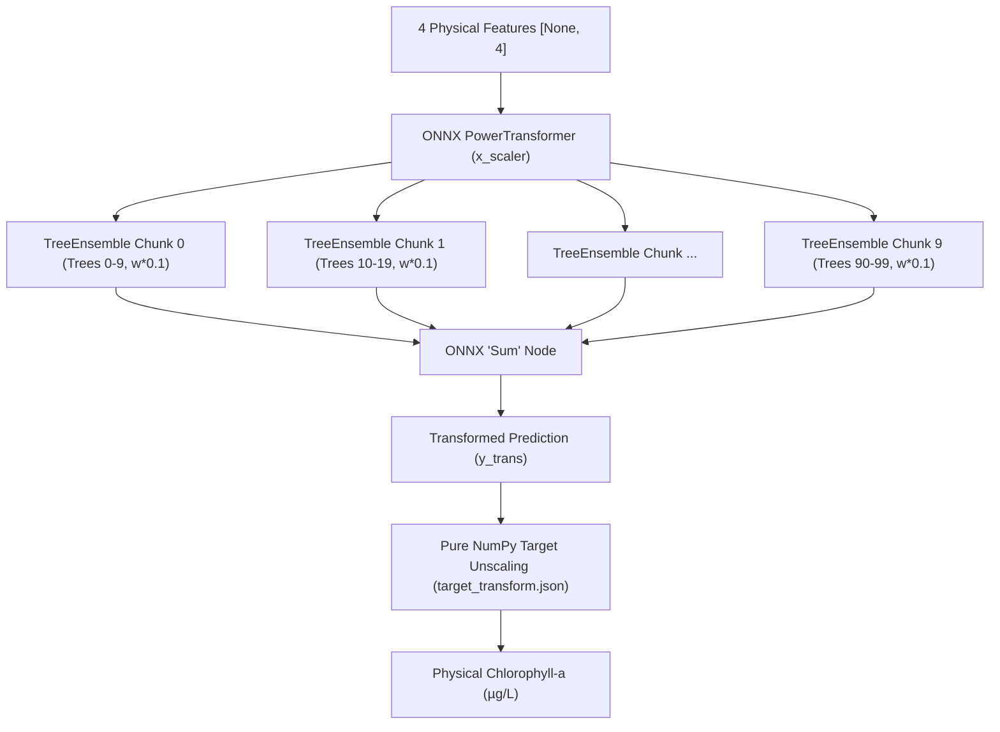

# Machine Learning Workstation Tier (`model-training`)

The **Machine Learning Workstation Tier** encompasses offline model training, hyperparameter validation, sequential temporal cross-validation, edge-ready model compression, ONNX graph decomposition and tree chunking, and remote Over-The-Air (OTA) deployment utilities for the Chlorophyll-a soft-sensor.

The tier produces artifacts for both runtime architectures:
* **V1 Scikit-Learn Baseline**: Exported as a serialized Joblib pipeline (`model.joblib`).
* **V2 ONNX Production Engine**: Exported via 10x10 tree chunking to an optimized ONNX graph (`model_v2.onnx`) with decoupled target unscaling parameters (`target_transform.json`).

---

## Methodological Rationale: Preventing Temporal Data Leakage

Freshwater reservoirs exhibit strong non-stationary hydrological dynamics, seasonal algal growth cycles, and meteorological regimes. Conventional random k-fold cross-validation randomly shuffles observations across the multi-year time series. In environmental time-series modeling, this introduces **temporal data leakage**: the model is trained on future points to predict the past, artificially inflating cross-validation performance ($R^2 > 0.95$) while failing catastrophically when deployed sequentially in the field.

To ensure realistic, deployable performance, this training pipeline strictly enforces **sequential, non-shuffled 10-fold cross-validation** (`KFold(n_splits=10, shuffle=False)`), following the methodology established by Mozo et al. (2022):

```
Time-Series Observations (217,000+ continuous samples across 3 years)
-------------------------------------------------------------------------------------------------
[ Fold 0 ][ Fold 1 ][ Fold 2 ][ Fold 3 ][ Fold 4 ][ Fold 5 ][ Fold 6 ][ Fold 7 ][ Fold 8 ][ Fold 9 ]
-------------------------------------------------------------------------------------------------
| <---------------- Chronological Training Partition (90%) --------------> | <--- Holdout (10%) -> |
                                                                            Exported for Edge SIL
```

The first 9 folds (representing the oldest continuous 90% of observations) form the training set for the production model. The final 10th fold (21,713 continuous samples spanning ~7.5 months) is strictly held out as unseen validation data and exported to `edge-system/sensor-sim/data/simulation_test_data.csv` to drive edge hardware validation.

---

## Machine Learning Pipeline Architecture

The soft-sensor pipeline is constructed using [Scikit-Learn](https://scikit-learn.org/) components assembled into an atomic, serializable object:



1. **Input Feature Normalization (`PowerTransformer`)**: Applies the Yeo-Johnson parametric power transform to make feature distributions more Gaussian-like and stabilize variance across extreme seasonal ranges.
2. **Target Transformation (`TransformedTargetRegressor`)**: Chlorophyll-a concentrations exhibit extreme positive skewness, with long right-hand tails during sporadic bloom outbreaks. The `TransformedTargetRegressor` applies Yeo-Johnson transformation to target $y$ during training and automatically inverts the prediction back to physical units ($\mu\text{g/L}$) during inference.
3. **Core Regressor (`RandomForestRegressor`)**: An ensemble of 100 decision trees (`n_estimators=100`, `random_state=22`). Random Forests effectively capture non-linear physicochemical relationships without requiring heavy tensor-graph runtimes on the edge.

---

## V2 ONNX Graph Decomposition & Tree Chunking (`export_onnx.py`)

Deploying Scikit-Learn pipelines on resource-constrained edge single-board computers introduces significant overhead (~2.4 GB RAM, 1.2 GB container images). To enable lightweight C++ runtime deployment:

1. **Decomposition**: `export_onnx.py` separates the input `PowerTransformer` from the inner `RandomForestRegressor`.
2. **Target Transform Parameter Extraction**: The learned Yeo-Johnson transformation parameters ($\lambda \approx 0.0283, \mu, \sigma$) are extracted to `edge-system/app-v2/target_transform.json`, enabling pure NumPy inverse power transformation (target unscaling) on the edge without Scikit-Learn dependencies.
3. **10x10 Tree Chunking with `Sum` Node**: Converting a 100-tree Random Forest directly into a single ONNX `TreeEnsembleRegressor` node frequently triggers serialization limits and produces unstable memory allocations on embedded runtimes. `export_onnx.py` splits the ensemble into 10 chunks of 10 trees each, scales target weights by $0.1$ ($1/10$), and aggregates the sub-outputs using an ONNX `Sum` node:



---

## Feature Dictionary

The soft-sensor relies exclusively on low-cost physical variables readily measurable by durable electrodes:

| Feature Name | Sensor Type | Typical Range | Physical & Biological Relevance |
|---|---|:---:|---|
| `EXO3(Temp_C)` | Thermistor | 4.0 – 28.0 °C | Directly controls metabolic and photosynthetic rates of cyanobacteria |
| `EXO3(spCond_uS_cm)` | Conductivity cell | 30.0 – 120.0 µS/cm | Proxy for total dissolved ions, mineral runoff, and reservoir volume dilution |
| `EXO3(pH)` | Glass electrode | 6.5 – 9.8 pH | Increases rapidly during blooms as algae consume dissolved aqueous $CO_2$ |
| `SystemBattery` | Voltage divider | 11.5 – 14.5 V | Direct proxy for solar irradiance charging the buoy solar panel |
| **`EXO3(Chlorophyll_ug_L)`** | **Target** | **0.0 – 100+ µg/L** | **Estimated concentration of photosynthetic pigment** |

> **Note on Deliberate Omission of Timestamps**: Explicit temporal features (such as `day_of_year`, `month`, `hour`) are deliberately excluded from the feature matrix. While calendar variables can boost static metrics, they induce severe temporal overfitting, rendering the model incapable of detecting unseasonal blooms triggered by unexpected thermal anomalies or fertilizer runoff.

---

## Execution Guide

### 1. Environment Setup
```bash
cd model-training

# Create virtual environment
python -m venv venv
source venv/bin/activate       # On Linux/macOS
# venv\Scripts\activate        # On Windows

pip install -r requirements.txt
```

### 2. Model Training & Asset Export (V1 & V2)
Executes sequential 10-fold cross-validation, fits the production pipeline, exports the compressed Joblib model, generates test data, and triggers chunked ONNX export:

```bash
python ml_regression_KFold_model_export.py
```

**Generated Artifacts:**
* `edge-system/app/model.joblib`: Serialized Scikit-Learn pipeline compressed with `compress=3`.
* `edge-system/app/model_metrics.json`: Cross-validation and holdout validation metrics.
* `edge-system/sensor-sim/data/simulation_test_data.csv`: Unseen chronological test data.
* `edge-system/app-v2/model_v2.onnx`: Chunked 10x10 ONNX ensemble (~535 KB).
* `edge-system/app-v2/target_transform.json`: Target transform parameters ($\lambda, \mu, \sigma$).

### 3. Dedicated ONNX Conversion (Optional)
To independently re-export the ONNX model from an existing `model.joblib`:
```bash
python export_onnx.py
```

### 4. Local Model QA Validation
Verifies that the exported `model.joblib` loads properly and computes accurate sample predictions against the test dataset:
```bash
python model_test.py
```

### 5. Over-The-Air (OTA) Model Deployment CLI

#### Deploy V1 Joblib Model:
```bash
python publish_ota.py \
    --model ../edge-system/app/model.joblib \
    --url https://github.com/org/repo/releases/download/v1.1.0/model.joblib \
    --version 1.1.0 \
    --broker 192.168.1.100 \
    --port 1883
```

#### Deploy V2 ONNX Model:
```bash
python publish_ota_v2.py \
    --model ../edge-system/app-v2/model_v2.onnx \
    --url https://github.com/org/repo/releases/download/v2.0.0/model_v2.onnx \
    --version 2.0.0 \
    --broker 192.168.1.100 \
    --port 1883
```

Both scripts calculate the SHA-256 hash of the local binary, format the JSON command payload, and publish to `buoy/ota/update` with QoS 1.

---

## Scientific Literature References

1. **Mozo, A., Morón-López, J., Vakaruk, S., Pompa-Pernía, A. G., González-Prieto, A., Aguilar, J. A. P., Gómez-Canaval, S., & Ortiz, J. M.** (2022). *Chlorophyll soft-sensor based on machine learning models for algal bloom predictions.* Scientific Reports, 12(1), 13529. [https://doi.org/10.1038/s41598-022-17299-5](https://doi.org/10.1038/s41598-022-17299-5)
2. **Martín-Suazo, S., Morón-López, J., Mozo, A., & Ortiz, J. M.** (2024). *Deep learning methods for multi-horizon long-term forecasting of Harmful Algal Blooms.* Knowledge-Based Systems, 301, 112279. [https://doi.org/10.1016/j.knosys.2024.112279](https://doi.org/10.1016/j.knosys.2024.112279)
3. **Yeo, I. K., & Johnson, R. A.** (2000). *A new family of power transformations to improve normality or symmetry.* Biometrika, 87(4), 954–959.
4. **Pedregosa, F., et al.** (2011). *Scikit-learn: Machine Learning in Python.* Journal of Machine Learning Research, 12, 2825–2830.
